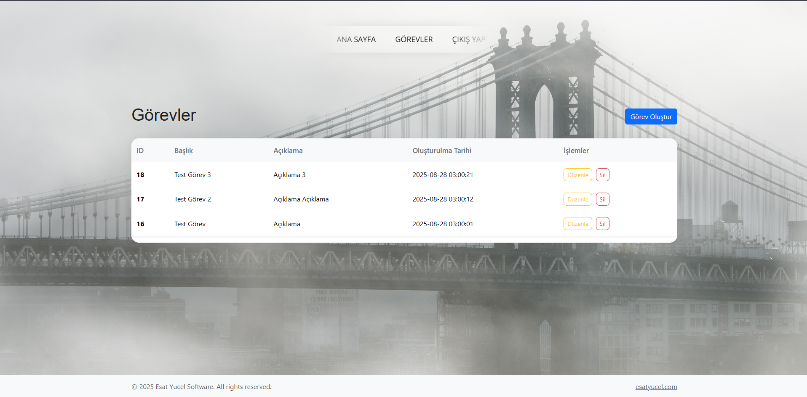

# 📌 Kişisel Görev Yönetimi (Task Manager) Projesi

Bu proje **PHP, MVC ve OOP prensipleri** kullanılarak geliştirilmiş bir **Görev Yönetimi Uygulaması**dır. Önceki Görev Yönetim Uygulamamdan tek farkı kullanıcı sistemi olmamasıdır.
Kendi görevlerini ekleyebilir, güncelleyebilir, silebilir ve listeleyebilir.

> Modern web geliştirme teknikleri ile tasarlandı ve responsive bir arayüz sunuyor.
> MVC yapısı sayesinde kodlar temiz, anlaşılır ve genişletilebilir.

---

## ✨ Özellikler

* Görev ekleme, düzenleme ve silme
* Responsive tasarım (mobil ve desktop uyumlu)
* MVC ve OOP prensiplerine uygun yapı

---

## 📸 Ekran Görüntüleri

### Görev Listesi

### Görev Ekleme

### Görev Güncelleme

---

-- Veritabanı oluştur
CREATE DATABASE IF NOT EXISTS task_manager CHARACTER SET utf8mb4 COLLATE utf8mb4_turkish_ci;
USE task_manager;

-- Tasks tablosu
CREATE TABLE IF NOT EXISTS tasks (
    id INT UNSIGNED AUTO_INCREMENT PRIMARY KEY,
    title VARCHAR(255) NOT NULL,
    description TEXT DEFAULT NULL,
    created_at TIMESTAMP DEFAULT CURRENT_TIMESTAMP,
    FOREIGN KEY (user_id) REFERENCES users(id) ON DELETE CASCADE
) ENGINE=InnoDB DEFAULT CHARSET=utf8mb4 COLLATE=utf8mb4_turkish_ci;

## 💻 Teknolojiler

* PHP 8+
* MySQL / MariaDB
* PDO
* HTML5 / CSS3 / Bootstrap 5
* MVC & OOP

---

## 🌐 Sosyal ve Destek

* Instagram: [@esatyucelsoftware](https://www.instagram.com/esatyucelsoftware)
* Web Sitesi: [https://esatyucel.com](https://esatyucel.com)

> Her türlü soru ve destek için iletişime geçebilirsiniz.

---

## 📝 Not

Bu proje tamamen **MVC ve OOP prensiplerine uygun** şekilde geliştirilmiştir.
Frontend ve backend ayrımı net, kod okunabilir ve kolay genişletilebilir şekilde tasarlanmıştır.
